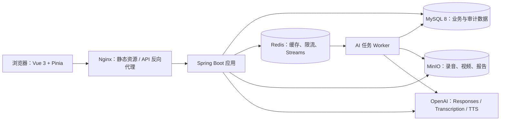
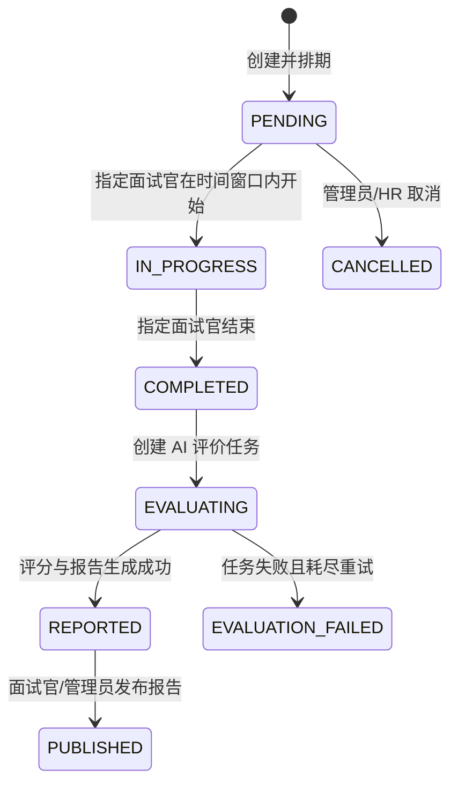

# AI 多模态智能模拟面试评测平台：系统设计（第二阶段）

## 1. 总体架构

采用前后端分离的模块化单体架构。业务 API、AI 编排和异步任务在同一 Spring Boot 应用中组织，通过清晰模块边界保持后续拆分能力；媒体文件由 MinIO 管理，MySQL 为事实数据源，Redis 负责缓存、限流、短期状态与异步任务队列。



## 2. 后端模块与分层

根包：`com.tyut.aiinterview`。保持 Controller、Service、Mapper 清晰分层，禁止 Controller 直接访问 Mapper。

```text
backend/src/main/java/com/tyut/aiinterview
├── common/                  # Result、PageResult、常量、分页、请求上下文
├── config/                  # OpenAPI、Jackson、MyBatis Plus、Redis、MinIO、异步配置
├── security/                # JWT、认证过滤器、权限表达式、当前用户
├── exception/               # 业务异常、错误码、全局异常处理
├── utils/                   # 安全、文件、时间、JSON 工具
├── auth/                    # Controller / Service / DTO / VO / Query
├── user/                    # 用户、角色、用户角色与个人中心
├── position/                # 岗位与能力模型
├── question/                # 分类、题库、题目、AI 题目生成
├── interview/               # 创建、状态机、题目编排、答案与历史记录
├── media/                   # 上传凭证、回调、媒体元数据、转写入口
├── ai/                      # OpenAI 适配器、提示词、会话、追问、任务 Worker
├── evaluation/              # AI/人工评价及复核
├── report/                  # 报告、PDF、发布
├── analytics/               # 管理统计与候选人趋势
├── audit/                   # 操作审计
├── entity/                  # 与表一一对应的 Entity
└── mapper/                  # MyBatis Plus Mapper
```

每个业务模块内部使用：`controller`、`service`、`dto`、`vo`、`query`；跨模块调用只能通过 Service 接口或领域事件，不共享 Controller 和 DTO。

## 3. 前端架构

```text
frontend/src
├── api/                     # Axios 实例与按领域拆分的 API
├── stores/                  # Pinia：auth、app、interview、upload
├── router/                  # 路由、角色守卫、懒加载
├── layouts/                 # AdminLayout、CandidateLayout、InterviewRoomLayout
├── views/                   # 业务页面
├── components/              # 可复用业务组件
├── composables/             # 录音、倒计时、分页、上传、轮询
├── types/                   # API/领域类型
└── styles/                  # 主题、变量、全局样式
```

候选人仅可使用候选人布局；管理员和 HR 使用管理布局；面试官使用面试工作台。前端路由守卫只改善体验，最终权限以服务端校验为准。

## 4. 权限模型与接口规范

### 授权原则

- JWT 仅携带用户 ID、用户名、角色和过期时间；服务端每次校验签名与用户启用状态。
- 管理权限使用 `ADMIN` / `HR`；面试官只能操作本人负责的面试；候选人只能读写本人面试与答案。
- 文件下载使用短期预签名 URL；对象名不由前端决定。
- 所有管理端变更记录操作审计。

### REST 规范

- 路径统一为 `/api/v1/**`，资源名用复数名词。
- 成功返回 `Result<T>`；分页返回 `PageResult<T>`，字段包含 `records`、`total`、`pageNo`、`pageSize`。
- 查询参数由 `*Query` 承载；写入参数由 `*Request` DTO 承载；响应为 `*VO`，禁止直接返回 Entity。
- 错误响应固定包含 `code`、`message`、`requestId`、`timestamp`；使用 RFC 风格 HTTP 状态码。
- OpenAPI 3 文档以 springdoc-openapi/Knife4j 暴露；生产环境文档受管理员权限保护。

## 5. 面试、答案与评价状态机



对现有 `interview.status` 保持 `PENDING / IN_PROGRESS / COMPLETED / CANCELLED` 四态；AI 处理、失败与报告发布状态由 `ai_task`、`evaluation` 和 `report` 表表达，避免单一状态字段混入多个职责。

答案采用幂等写入：唯一键为 `interview_question_id`。候选人只能在 `IN_PROGRESS` 期间写入；音频/视频由媒体表引用，转写与分析结果作为独立任务输出。

## 6. AI 与多媒体处理设计

### OpenAI 适配层

- `ResponsesClient`：负责结构化出题、追问、评分、评价、总结；要求 JSON Schema 输出，持久化模型、提示词版本、输入摘要、输出和耗时。
- `TranscriptionClient`：调用 Whisper 转写音频；转写文本按时间片保存。
- `SpeechClient`：调用 TTS 生成题目播报；结果写入 MinIO 并通过媒体表关联。
- 所有客户端实现统一超时、重试、脱敏日志和错误映射；API Key 只从环境变量读取。

### 异步任务

长耗时动作创建 `ai_task` 数据行后投递 Redis Stream；Worker 消费者组执行任务。数据库中的任务状态是最终可信状态，Redis 仅承担投递和短期协调。任务按指数退避重试，达到最大次数后标记失败并告警。

任务类型：`QUESTION_GENERATION`、`TRANSCRIPTION`、`TTS`、`FOLLOW_UP`、`ANSWER_EVALUATION`、`REPORT_GENERATION`、`VIDEO_ANALYSIS`。

## 7. 部署拓扑与配置

Docker Compose 提供开发/单机部署：`nginx`、`frontend`、`backend`、`mysql`、`redis`、`minio`。Linux 生产环境使用环境变量或密钥管理服务注入配置，不将 `.env`、JWT 密钥、OpenAI Key 或数据库密码提交仓库。

核心环境变量：`DB_URL`、`DB_USERNAME`、`DB_PASSWORD`、`REDIS_HOST`、`MINIO_ENDPOINT`、`MINIO_ACCESS_KEY`、`MINIO_SECRET_KEY`、`OPENAI_API_KEY`、`OPENAI_MODEL`、`JWT_SECRET`、`CORS_ALLOWED_ORIGINS`。

Nginx 提供 SPA 回退、`/api` 代理、上传大小限制、TLS 终止和基础安全响应头。应用公开 `/actuator/health`，其余 Actuator 端点仅限内部网络或管理员访问。

## 8. 质量策略

- 后端：Service 单测、Controller 集成测试、MySQL/Redis/MinIO Testcontainers 集成测试、权限回归测试。
- 前端：类型检查、构建检查、关键角色路由与面试作答组件测试。
- CI：格式/静态检查、测试、构建镜像、依赖漏洞检查；镜像使用不可变版本标签。
- 观测：结构化日志、requestId、任务失败告警、慢接口/AI 调用耗时指标。

## 9. 第三阶段输出

数据库设计阶段将给出完整 MySQL 8 DDL、迁移顺序、索引与外键、数据字典、ER 图和可重复执行的初始化/大规模测试数据脚本。
