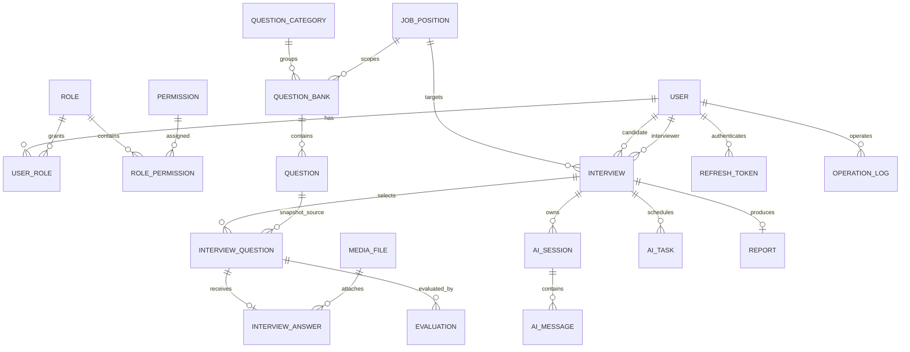

# AI 多模态智能模拟面试评测平台：数据库设计（第三阶段）

## 1. 设计约定

- 数据库：MySQL 8.0+，InnoDB，`utf8mb4_0900_ai_ci`。
- 主键统一使用 `BIGINT UNSIGNED`；所有时间使用 `DATETIME`，由应用以 `Asia/Shanghai` 业务时区写入。
- 可软删除的业务表使用 `deleted_at DATETIME NULL`：`NULL` 表示有效记录，禁止以 `0/1` 表示时间型逻辑删除。
- 密码只保存 BCrypt 哈希；令牌只保存不可逆哈希；媒体对象只保存对象存储定位信息。
- 外键保护核心引用完整性；高并发读写表使用与查询路径匹配的复合索引。

## 2. 实体关系图

## 3. 表职责

| 分组 | 表 | 职责 |
| --- | --- | --- |
| 身份与授权 | `user`、`role`、`permission`、`user_role`、`role_permission`、`refresh_token` | 账号、RBAC、刷新令牌 |
| 招聘资产 | `job_position`、`question_category`、`question_bank`、`question` | 岗位能力模型、分类、题库与题目 |
| 面试过程 | `interview`、`interview_question`、`interview_answer`、`media_file` | 排期、题目快照、作答、媒体对象 |
| AI 能力 | `ai_session`、`ai_message`、`ai_task` | 多轮对话、追问、转写、评分、任务重试 |
| 评价与报告 | `evaluation`、`report` | AI/人工评分、报告生成与发布 |
| 审计 | `operation_log` | 管理和敏感操作审计 |

## 4. 数据一致性与索引策略

- `user.username`、`email`、`phone` 唯一；停用用户不可登录，但历史引用保持有效。
- `user_role`、`role_permission` 使用联合主键消除重复授权。
- `interview_question` 同一面试中题目与序号均唯一；`interview_answer` 对每道面试题唯一，实现幂等保存。
- `evaluation` 用 `interview_question_id + source + evaluator_id` 约束人工/AI 评价来源；AI 评价的 `evaluator_id` 为 `NULL`。
- 高频路径建立索引：用户状态、题库检索、候选人/面试官排期、面试状态、任务领取、报告发布和审计查询。
- 报告采用一场面试一份主报告约束；报告版本通过 `generation_version` 和任务审计追溯，不复制面试记录。

## 5. 初始化与迁移策略

完整空库结构位于 [v2/01-schema_v2.sql](D:/AAAAAAAtyut/ai-interview-platform/docs/database/v2/01-schema_v2.sql)。该脚本只用于新建环境，不会自动被当前 Docker 初始化目录执行，避免与现有 v1 脚本冲突。

现网升级将于部署阶段提供版本化迁移脚本，按“新增表 → 新增列/索引 → 数据回填 → 应用切换”的顺序执行；不使用破坏性重建。

## 6. 测试数据策略

测试数据脚本将以事务和可重复的固定命名规则生成：5 名管理员、20 名面试官、100 名候选人、1,100 道分领域题目与 100 场关联面试。密码由 Spring Security BCrypt 生成且所有外键按依赖顺序写入。
